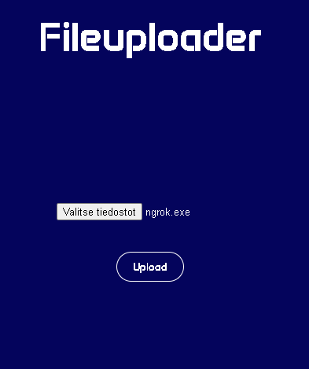

# Fileuploader

Fileuploader is a Flask web application that allows users to upload files to the server. It utilizes Ngrok for secure tunneling to expose the local server to the internet and allows users to access the file uploader interface remotely.



## Features

- **Ngrok Integration**: Utilizes Ngrok for secure tunneling to expose the local server to the internet, allowing remote access to the file uploader.
- **File Upload**: Users can upload multiple files simultaneously.
- **Stylish Interface**: Provides a user-friendly interface with file upload functionality and visual file type icons.
- **Local IP Display**: Displays the local IP address and port for accessing the file uploader interface locally.

## Requirements

- Python 3.x
- Flask
- Requests
- Pillow (PIL)
- Tkinter (for displaying QR code)
- qrcode
- Ngrok

## Usage

1. Clone the repository:

    ```bash
    git clone https://github.com/Suomimuumi/Python-Fileuploader
    ```

2. Install dependencies:

    ```bash
    pip install -r requirements.txt
    ```

3. Run the application:

    Run the app from init.exe file.

4. Access the file uploader interface:

   - Locally: Visit [http://localhost:8080](http://localhost:8080) in your web browser.
   - Remotely: Use the Ngrok URL provided after starting Ngrok.

## Configuration

Author: Arttu Väisänen
